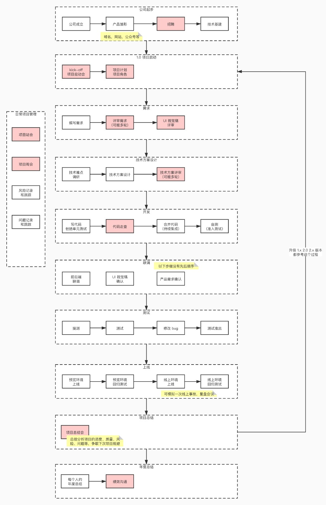
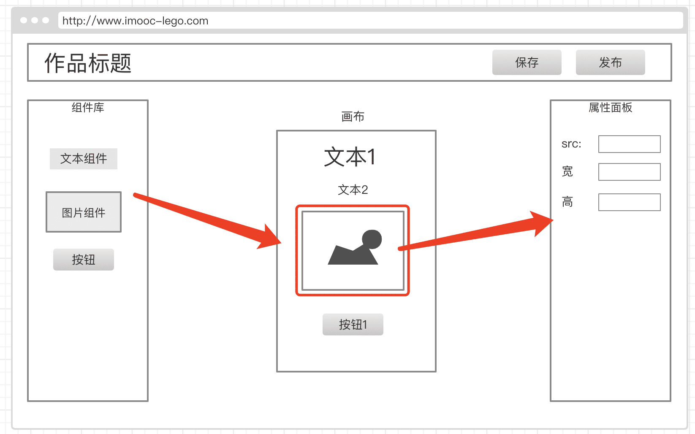

# 需求分析和架构设计
## 学习方法
* 要有耐心，不要一心想着写代码，觉得需求和设计不重要
* 抛开你固有的程序员思维，开始准备接受架构师思维
* 要坚信：技术永远都是为业务服务的，技术是实现业务增长的工具
## 注意事项
* 不要关注细节，要看整体，看范围
* 设计时判断可行性，不确定的就调研一下（这需要大量的工作经验积累，技术能力）
* 设计要考虑复杂度，越简单越好，不要过度设计，不要为了设计而设计
## 需求分析
::: tip 注意  
脱离业务的架构就是耍流氓。架构师必须要深入理解需求、参与需求、看透需求背后的业务本质。
:::
没有业务就不需要架构
### 主要产出
* 熟悉产品需求
* 学会以架构师的思维分析需求
* 全局思维、整体思维、闭环思维

### 注意事项
* 对待需求要有耐心，不要一心只想着写代码
* 技术永远都是为业务服务的，分清甲方乙方
* 需求即业务，无业务不架构，坚信这一点

## 以架构师的思维来分析需求
程序员对于需求和业务能力的理解可能会影响到你的API设计，进而影响到你的研发

以下都以[慕课乐高](https://www.imooc-lego.com)的需求为例
### 浅层需求
一眼就能看出的需求即产品表面的业务功能。例如慕课乐高的登陆、查看模板、新建模板、编辑等功能

### 深度需求
不容易一眼看到的需求，但是却很重眼的需求

#### 作品管理
* 删除和恢复
* 转增（例如员工离职交接工作等）
* 赋值

#### 作品统计
业务闭环，统计就能很好的体体现这一点，有输入就要有输出
* 统计
* 分渠道统计，渠道对于运营人员非常重要
  * 例如分析流量流入的来源
#### 作品发布
* url不能变
* 支持多渠道

#### 分享
分享 - 对业务增长负责

#### 后台管理
全局把控，让一切尽在掌握之中
* 数据统计
* 作品管理（快速下线作品，防止有违规内容）
* 用户管理（快速冻结用户，防止违规用户）
* 模板管理（控制展示哪些模板等）

## 架构设计
::: tip 提示  
任何看似复杂的设计，都是让整个系统变的更简单
:::
“很多程序员学了大量的算法和计算机基础，然而在工作中却派不上用场。这是非常正常的，因为这些内容是为了在科学领域做研究准备的。而在业务领域，大多是如何把现有业务在软件中模拟出来的问题，并没有太高深的数学问题。并且现在的计算机硬件，比如 CPU、内存、存储都很便宜，也不需要斤斤计较的去抠空间和时间复杂度。这些都导致所学不能致用。反而如何能够高效的把业务用软件表达出来，并能够随着业务的增长，让软件也快速长大，则变成了一个更重要的问题。这一点可能是当前计算机软件教育需要思考的问题。” —— 《聊聊架构》
### 分析需求，确定需要创建的项目
先不看细节，看整体，这一步就是确定项目的范围。确定范围是做任何事情的第一步。

范围确定好了，剩下的事情，即便有问题，也属于“人民内部矛盾”。该购买第三方服务，还是该自研，或者该放弃，就看实际情况了。

以[慕课乐高](https://www.imooc-lego.com)为例
#### 需要那些项目
从需求来看，比较重要的几个方面：B 端和编辑器，H5 ，管理后台

* B 端和编辑器,做的前后端分离
* H5 适合做SSR，因为要考虑性能
* 管理后台，做前端分析
::: tip 注意
使用ssr需要分场景，一般来讲，toB 的不适合用，toC 的适合用。所以，架构设计要考虑成本，要用最简单的方案，不要为了设计而设计。
:::
#### 独立的业务组件库
把功能独立的业务组件库和模块给抽离出来，方便其他地方复用

### 统计服务
熟悉需求很重要，而且，我们非常明确，这个需求是我们业务环节中非常重要的一部分，没有它，我们业务就无法闭环，就跑不通。
#### 为什么要自研统计
要实现这个功能，我们就需要自定义事件统计。普通的 pv 统计，是无法满足要求的。
* 支持自定义事件
* 支持open API ，这个非常重要

需求不能砍掉，第三方服务无法满足需求，只能自研一个
* 日志收集
* 日志分析
* OpenAPI

### 各个项目之间的关系
画张流程图表示各个模块之间的关系
### 核心数据结构
问题
* 在点“保存”按钮的时候，往服务端传递的数据结构是什么样子的？
* 如何保证画布和属性面板是同步更新的？
* 如果在扩展一个“图层”面板，数据结构该怎么设计？

思路
* 组件设计尽量符合vnode结构即应该服务大多数业界规范的结构
* 用数组来组织数据，有序（图层就是有序的）
* 尽量使用引用关系，不要冗余

数据流转
* 分析数据流转的过程

注意：千万不要扣细节

做技术方案设计，为的就是寻找一个方向，论证可行性、拓展性、复杂度高低
### 写技术方案设计文档
如何写
* 随性一点，解释一下你要如何做即可
* 可以尝试写一部分代码，捋一捋思路，再来写文档
* 如果写不出来，说明还没有想明白，正好暴露了问题